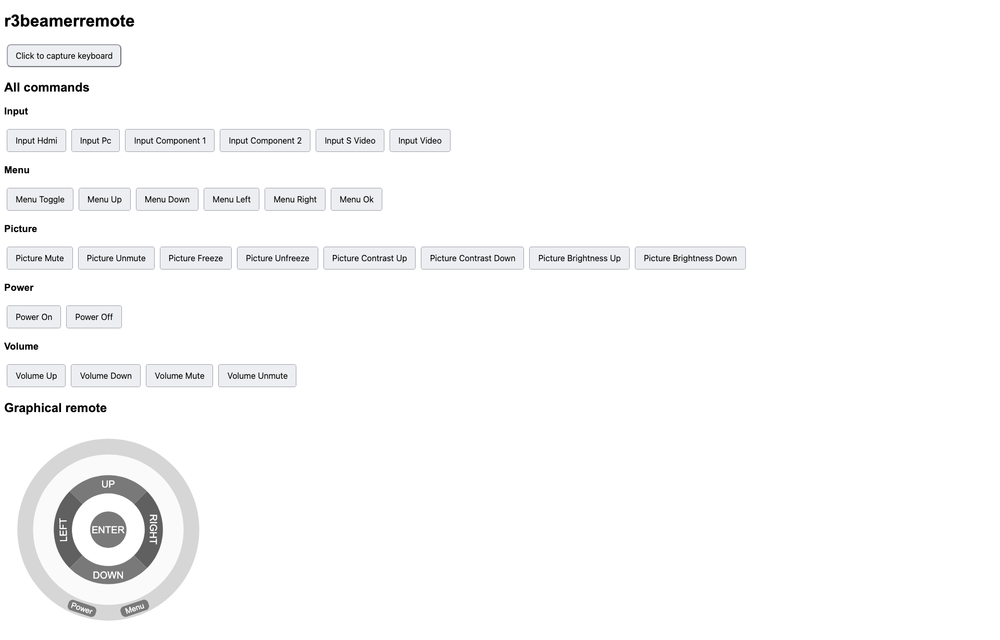

# python-beamer-remote

This is a reimplementation of [the esp32 version](https://github.com/realraum/esp32-realraum-beamer-remote). 
This code supports listening for commands via MQTT and then controlling our benq beamer via TCP.

## Requirements

There is a requirements.txt which can be used with pip to install everything.

```bash
pip install -r requirements.txt
```

## Docker container

As of now, this is not planned. Feel free to add one 

## Screenshot

